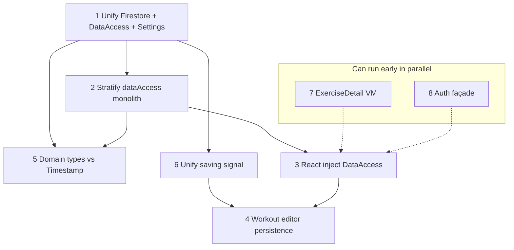

# Roadmap: address all architecture deepening candidates

This is the **execution plan** for the opportunities described in [architecture-deepening.md](./architecture-deepening.md). It orders work to minimize rework, keeps parallel tracks explicit, and defines exit criteria per phase.

| Candidate (deepening doc)     | Roadmap phase |
| ----------------------------- | ------------- |
| 1 Unify Firestore / Settings  | Phase 1       |
| 2 Stratify `dataAccess`       | Phase 2       |
| 5 Domain types vs `Timestamp` | Phase 3       |
| 6 Unified saving              | Phase 4       |
| 3 React inject `DataAccess`   | Phase 5       |
| 4 Workout editor persistence  | Phase 6       |
| 7 Exercise detail VM          | Phase 7       |
| 8 Auth façade                 | Phase 8       |

Phases are **sequential on the critical path** except where the diagram and “two tracks” table call out parallelism.

## Dependency overview

**Reading the graph**

- **1 → 2:** One coherent data boundary makes stratification (facade or slices) meaningful; doing 2 before 1 risks moving code that is still duplicated with `firestore.ts`.
- **1 / 2 → 5:** Mappers and neutral domain types belong at the repository edge; introducing them while the boundary is moving avoids two large migrations.
- **1 → 6:** All writes should go through known instrumentation before consolidating “saving” semantics.
- **6 → 4:** Editor-local saving should align with global saving after the global path is defined.
- **2 → 3:** Inject a **stable** public `DataAccess` (or façade) shape; injecting while the module is still splitting causes churn in providers and mocks.
- **3 → 4:** Default persistence factories should receive deps from the app root, not reintroduce globals.
- **7, 8:** Largely independent; can start anytime. **8** is optional in the numbered list but included here for completeness.

---

## Phase 0 — Baseline and guardrails

**Goal:** Refactors stay shippable in small slices.

| Action                                           | Notes                                                             |
| ------------------------------------------------ | ----------------------------------------------------------------- |
| Run full quality gate after each mergeable slice | `format`, `lint`, `typecheck`, `build`, `test` per AGENTS.md      |
| Prefer feature flags only if needed              | Single-user app: usually unnecessary; use incremental PRs instead |
| Document public seams as you introduce them      | One-line comment or type export naming the “boundary” module      |

**Exit:** No code change required; team agrees to slice size (e.g. one aggregate or one page migration per PR where possible).

---

## Phase 1 — Data path unification (Candidate **1**)

**Goal:** Settings and CRUD share one implementation for timestamps, cascades, and shared query/write helpers. Remove the parallel `firestore.ts` vs `dataAccess` private helpers split.

| Step | Deliverable                                                                                                                                  |
| ---- | -------------------------------------------------------------------------------------------------------------------------------------------- |
| 1.1  | Inventory every import of `firestore.ts` from pages/hooks vs `dataAccess`; list Settings export/CSV paths explicitly                         |
| 1.2  | Introduce or extend a single internal layer (repository or enhanced `dataAccess` core) that owns `add`/`patch`/`delete`/cascade + timestamps |
| 1.3  | Migrate Settings off raw `getCollectionRef` + `getDocs`/`query` onto that layer                                                              |
| 1.4  | Delete or shrink duplicate helpers in `firestore.ts`; keep only what is truly cross-cutting if anything remains                              |
| 1.5  | Consolidate tests: boundary tests for cascade/timestamp behavior; update `SettingsPage` tests to mock the new seam                           |

**Exit criteria**

- No feature code bypasses the unified path for the operations covered by 1.2 (writes, deletes with cascade, shared reads used by Settings).
- [architecture-deepening.md](./architecture-deepening.md) §1 testing strategy satisfied for the scope you chose (document any intentional deferrals).

**Risk:** Large blast radius — ship 1.2 with one aggregate first if needed, then expand.

---

## Phase 2 — Stratify `dataAccess` (Candidate **2**)

**Goal:** Replace one shallow mega-module with a **facade + internal modules** (by aggregate: exercises, days, templates, workouts, sets) or equivalent vertical slices. Public export remains one `DataAccess`-shaped object for callers until Phase 3.

| Step | Deliverable                                                                                                                           |
| ---- | ------------------------------------------------------------------------------------------------------------------------------------- |
| 2.1  | Define internal module boundaries (folders or `dataAccess/*.ts`) and move implementations without changing external method signatures |
| 2.2  | Centralize `FIRESTORE_IN_MAX` chunking, name resolution, and list aggregations behind those modules                                   |
| 2.3  | Keep `withSaving` at a single wrapper boundary (prepares Phase 6)                                                                     |
| 2.4  | Boundary tests per slice for non-trivial queries and list/stats behavior                                                              |

**Exit criteria**

- `dataAccess.ts` is a thin re-export or small façade; complex logic lives in named modules.
- Mock surface in tests can optionally shrink later in Phase 3; for this phase, existing tests still pass.

---

## Phase 3 — Domain types and Firestore adapters (Candidate **5**)

**Goal:** Domain types in `src/types` do not depend on `firebase/firestore` `Timestamp`; conversion lives at the data boundary.

| Step | Deliverable                                                                                                       |
| ---- | ----------------------------------------------------------------------------------------------------------------- |
| 3.1  | Introduce neutral date/time fields (e.g. `Date`, ISO string, or numeric epoch) for domain-facing types            |
| 3.2  | Add `fromFirestore` / `toFirestore` (or per-aggregate mappers) next to the repository/`dataAccess` implementation |
| 3.3  | Migrate callers and tests: fixtures use neutral types                                                             |
| 3.4  | Remove `Timestamp` from exported domain types in `types/index.ts`                                                 |

**Exit criteria**

- Feature and hook code outside `src/lib` (and mapper modules) does not import `Timestamp` for domain logic.
- Mapper tests cover round-trip and edge fields.

**Note:** Phases 2 and 3 can **overlap in time** (same PR series) if mappers are introduced per slice as files move; the roadmap keeps them separate for clarity.

---

## Phase 4 — Unified saving signal (Candidate **6**)

**Goal:** One authoritative model for “in-flight writes” consumed by Layout and by the workout editor (no double counting or divergent UX).

| Step | Deliverable                                                                                                                           |
| ---- | ------------------------------------------------------------------------------------------------------------------------------------- |
| 4.1  | Document every path that triggers `startSaving`/`endSaving` today (including `withSaving` and editor-local state)                     |
| 4.2  | Choose single strategy: extend global store with scopes/labels, or route editor saves through the same wrapper as `dataAccess` writes |
| 4.3  | Remove redundant editor `isSaving` if global state is sufficient, or bridge editor to the same store                                  |
| 4.4  | Tests: Layout + editor behavior for overlapping saves                                                                                 |

**Exit criteria**

- No two independent boolean/ref mechanisms represent the same user-visible saving state for the same operation class.

---

## Phase 5 — React injection for data access (Candidate **3**)

**Goal:** Features obtain data access via context (or equivalent), not `import { dataAccess } from "../lib/dataAccess"`.

| Step | Deliverable                                                                                                         |
| ---- | ------------------------------------------------------------------------------------------------------------------- |
| 5.1  | Add `DataAccessProvider` + `useDataAccess()` (or split ports if you introduce thinner interfaces) at app root       |
| 5.2  | Migrate pages and `useExercisePicker` incrementally                                                                 |
| 5.3  | Replace `vi.mock("../lib/dataAccess")` with wrapper + fake in tests where practical                                 |
| 5.4  | Keep a deprecated re-export or single bridge file only as long as needed; remove singleton import from feature code |

**Exit criteria**

- No production feature imports the concrete singleton directly (tests may use test utilities).
- `mockDataAccess` usage simplified or scoped to provider tests.

---

## Phase 6 — Workout editor depth (Candidate **4**)

**Goal:** `createDefaultWorkoutEditorPersistence()` does not import global `dataAccess`; persistence is a port wired from the provider. Hook owns debounce/save sequencing; page stays thin.

| Step | Deliverable                                                                                    |
| ---- | ---------------------------------------------------------------------------------------------- |
| 6.1  | Change persistence factory to accept `DataAccess` (or a minimal `WorkoutSetsPort`) from caller |
| 6.2  | Wire factory in app root / workout route using `useDataAccess()`                               |
| 6.3  | Optional: extract pure group builders to a non-hook module if it clarifies testing             |
| 6.4  | Boundary tests: persistence call order, debounced flush, mode switches                         |

**Exit criteria**

- Default production path has no hidden `dataAccess` import inside `workoutEditorPersistence.ts`.
- Phase 4 saving semantics respected for editor-initiated writes.

---

## Phase 7 — Exercise detail read model (Candidate **7**)

**Goal:** Pure view-model + chart inputs extracted from `ExerciseDetail.tsx`; page wires data only.

| Step | Deliverable                                                                                     |
| ---- | ----------------------------------------------------------------------------------------------- |
| 7.1  | Extract `buildExerciseDetailViewModel(...)` (name as you prefer) to `src/lib/` or `src/domain/` |
| 7.2  | Table-driven unit tests for sorting, top-set selection, set numbering, chart series             |
| 7.3  | Page reduced to `useMemo` calling the pure function or loading state only                       |

**Exit criteria**

- Core ranking/sort logic covered without router/Firebase in tests.

**Parallelism:** Can run **anytime** after Phase 0; ideal as a low-risk PR between heavier phases.

---

## Phase 8 — Auth façade (Candidate **8**, optional)

**Goal:** Firebase auth details and allowlist logic concentrated behind a small port/context API; routes consume stable states.

| Step | Deliverable                                                                   |
| ---- | ----------------------------------------------------------------------------- |
| 8.1  | Define explicit auth states (`loading`, `signedOut`, `ready`, `denied`, etc.) |
| 8.2  | Move allowlist check to one place; test with fake auth                        |
| 8.3  | `ProtectedRoute` reads only context / façade                                  |

**Exit criteria**

- Components under `src/pages` do not reach for `auth` or `onAuthStateChanged` directly except through the façade.

**Parallelism:** Can run in parallel with Phases 1–3.

---

## Suggested schedule (two tracks)

| Track A (critical path)         | Track B (parallel when capacity allows) |
| ------------------------------- | --------------------------------------- |
| Phase 1                         | Phase 7                                 |
| Phase 2                         | Phase 8                                 |
| Phase 3 (overlap 2 as feasible) |                                         |
| Phase 4                         |                                         |
| Phase 5                         |                                         |
| Phase 6                         |                                         |

---

## Final checklist (all candidates addressed)

- [ ] **1** Single data path; Settings on shared layer; duplicate `firestore` helpers removed or justified
- [ ] **2** `dataAccess` stratified; façade stable for injection
- [ ] **3** Context/provider; no feature singleton import
- [ ] **4** Editor persistence injected; no hidden global `dataAccess`
- [ ] **5** Domain types free of `Timestamp`; mappers at boundary
- [ ] **6** One saving model for Layout + editor
- [ ] **7** Exercise detail view model extracted and tested
- [ ] **8** Auth façade and route guard on stable states (if in scope)

---

## After implementation

Update [architecture-deepening.md](./architecture-deepening.md) with chosen interfaces (addendum per section) or archive superseded problem statements so future readers see **as-built** boundaries.
